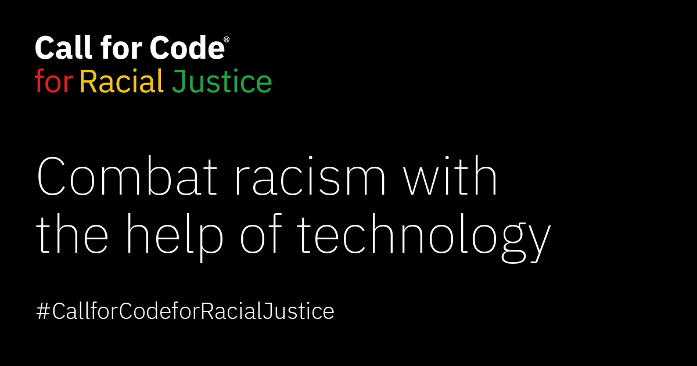

# **Open Sentencing Solution Starter**

Open Sentencing exposes bias and empowers public defenders to directly address racial disparities in the system.

## **Table of Contents**
* [ What is Open Sentencing ](#out)
* [ How Tech Can Help ](#help)
* [ Idea/Solution ](#solution)
* [User and Skills](#skills)
* [Browser Support ](#browser)
* [Architecture Diagram](#architecture)
* [Technical Materials](#steps)
  * [Aggregator](#agg)
  * [UI](#ui)
  * [Open Sentencing Model](#open)
  * [Report Generator](#report)
  * [Bias Detection Engine](#bias)
* [Data Sources](#sources)
* [Future Implementations/Ideas](#future)
* [References](#references)
* [License](#license)

## **What is Open Sentencing?**
People in the Black Community are faced with harsher downstream effects (charged at higher rates, assigned more significant charges, convicted at higher rates, given longer sentences, and denied parole more often) than people of other races for similar offenses. This systemic bias in the justice system has a deep and lasting impact on black families, communities and the country. Open Sentencing exposes bias and empowers public defenders to directly address racial disparities in the system.  Our solution includes an engaging user interface (UI) that feeds into our pre-trained Bias & Disparity Detection Engine. This innovative engine analyzes fact patterns and rapidly provides statistical analysis that highlights deviations from guidelines by race throughout an accused persons judiciary process.  The reports from Open Sentencing provides clear insights for the public defender to aid in defending against detected bias, ultimately & ideally fairly reducing incarceration for members of the black community.

We created a tool with the goal of ***reducing sentencing*** for people impacted by **bias** and **racism**.

> We found that nearly all sentencing is completed at the plea level for defendants represented by a [*public defender*](https://www.youtube.com/watch?v=xqLE4ryWMX4).  We want to provide more information to arm public defenders against powerful and more often strongly equipped prosecutors and judges.

## **How Tech Can Help**
A simple to use tool can make the process of collecting and analyzing data quicker and easier for already very busy and often overloaded public defenders. Our tool can quickly highlight bias and other insights saving valuable time allowing more focused on reducing sentences.  Black Lives Matter - let's fairly give people more of life outside of prison.  

>Our solution works with the bias detection engine - Learn more here: https://github.com/Call-for-Code-for-Racial-Justice/bias-detection-engine

## **Idea/Solution**

Web application where a defense attorney / public defender can upload information about a case and the defendant.

* Analyzes available data
* Provides public defense attorneys with insights, connections, and bias indicators for each case
* Information and outcomes from this tool will be fed into a public site where anyone can see trends and request updates for **bias** in the criminal justice system

> Public defenders can then act immediately on that information to negotiate a better plea or sentence for the defendant.

*Key Highlight*

Our tool will clearly indicate and denote when bias/racism was detected and highlight it for attorneys to use in defense process.
Bias detection (highlighted clearly), demographics from uploads, key sentencing information that we mined and have within our tool, as well as recommendations from our tool make a public defenders job easier and frees up time to focus on case(s).

## **Users and Skills**

* *Developers*:  skills: React, OSS, full stack (java, python), data science; user experience: need to develop a getting started process
* *End-users*:  skills: online training on navigating the tool
* *Public*: skills:  none (intuitive interface); user experience:  immediate, informative, targeted information
* *Private beneficiaries*:  N/A
* *SMEs* (Lawyers, American Bar Association, Southern Poverty Law Center, Judiciary NGOs):  skills:  unsupervised learning for training and expanding the ML/bias detection engine for new personas, locales, scope, crime types, etc.

## Browser Support:
* Chrome
* Edge
* Firefox
* Internet Explorer
* Safari

## Architecture Diagram

## **Technical Materials**

Aggregator
* [Repo](https://github.com/Call-for-Code-for-Racial-Justice/Open-Sentencing-Aggregator)
* [OpenAPI](https://github.com/Call-for-Code-for-Racial-Justice/Open-Aggregator/blob/master/src/main/resources/swagger.yaml)
* [Service URL](https://outcarcerate-aggregator-decarcerate.embrace-dev-ocp43-vpc-7ec5d722a0ab3f463fdc90eeb94dbc70-0000.us-east.containers.appdomain.cloud/)

UPLOAD VIDEO DEMO HERE

UI (User-Interface)
*  [Mock-up](https://ibm.invisionapp.com/share/Q5O0KIVUNE8)
*  [Repo](https://github.com/Call-for-Code-for-Racial-Justice/Open-Sentencing-UI)

Open Sentencing Model
* [Repo](https://github.com/Call-for-Code-for-Racial-Justice/Open-Sentencing-Model)
* [Demo]

Report Generator
* [Repo](https://github.com/Call-for-Code-for-Racial-Justice/Open-Sentencing-Report-Generator)
* Demo:

Bias Detection Engine
* [Repo](https://github.com/Call-for-Code-for-Racial-Justice/bias-detection-engine)
* Demo:

## **Data Sources**

* [United States Sentencing Commission](https://ida.ussc.gov/analytics/saw.dll?Dashboard)
* Uploaded files from lawyers, police, court staff, or links to case file management systems.
* Others Data Sources In progress (ideally we'd expand to all levels of government).

## Future Implementations/Ideas
Going forward, we hope the solution will have a global impact on the advancement of racial justice, and with the solution -- that institutions, organizations, and individuals -- can continue to build an understanding, participation, and collaboration to sustain and grow commitments towards an equitable safe and enhanced quality of life. Race will have nothing to do with who is in jail. The solution will get adopted at each level of government – from cities, counties, states and federal – with the associated data available and enhanced to enable effective analysis and make recommendations to address the disparities in sentencing of Black defendants. We want to find partners who can help us get access to bigger and richer data sets, as well as partners who can help us build a solution that meets all of the legal and security standards that will allow us to use more information about individual defendants and cases.

## **References**

* [Racial Disparity in Federal Criminal Sentences](https://repository.law.umich.edu/cgi/viewcontent.cgi?article=2413&context=articles)
* [Racial, Ethnic, and Gender Disparities In Federal Sentencing Today](https://www.ussc.gov/sites/default/files/pdf/research-and-publications/research-projects-and-surveys/miscellaneous/15-year-study/chap4.pdf)
* [The Growing Racial Disparity in Prison Time](https://www.themarshallproject.org/2019/12/03/the-growing-racial-disparity-in-prison-time)
* [Racial Disparity](https://www.sentencingproject.org/issues/racial-disparity/)
* [Unequal Treatment: Racial and Ethnic Disparities in Miami-Dade Criminal Justice](https://www.aclufl.org/sites/default/files/6440miamidadedisparities20180715spreads.pdf)
* [From police to parole, black and white Americans differ widely in their views of criminal justice system](https://www.pewresearch.org/fact-tank/2019/05/21/from-police-to-parole-black-and-white-americans-differ-widely-in-their-views-of-criminal-justice-system/)
[Public Defenders: Last Week Tonight with John Oliver ](https://www.youtube.com/watch?v=USkEzLuzmZ4)
[America's Public Defense System Is in Crisis](https://www.youtube.com/watch?v=xqLE4ryWMX4)

In addition, sponsor user interview Based Research Conducted by Open Sentencing Team included a judge and attorneys.

[Find Support Here](https://github.com/Call-for-Code/Embrace-Judicial-Reform/blob/main/SUPPORT.md)

Contributions are subject to the Developer Certificate of Origin, Version 1.1 (DCO) (https://developercertificate.org/) and the Apache Software License, Version 2 (http://www.apache.org/licenses/LICENSE-2.0.txt)

*Thank you* for your interest and we truly hope this helps!

#### Team Members:

This solution starter was created by a team of IBM/Red Hat employee volunteers as part of the Call for Code for Racial Justice Challenge.

## **License**
The embed link applications are licensed under the Apache License, Version 2. Separate third-party code objects invoked within this code pattern are licensed by their respective providers pursuant to their own separate licenses. Contributions are subject to the [Developer Certificate of Origin, Version 1.1](https://developercertificate.org/) and the [Apache License, Version 2](https://www.apache.org/licenses/LICENSE-2.0.txt).
[Apache License FAQ](https://www.apache.org/foundation/license-faq.html#WhatDoesItMEAN)
The embed sites provides applications using data that has been modified for use from its original source, www.ida.ussc.gov, an official website of the U.S. Sentencing Commission. The U.S. Sentencing Commission makes no claims as to the content, accuracy, timeliness, or completeness of any of the data provided at this site. The data provided at this site is subject to change at any time. It is understood that the data provided at this site is being used at one’s own risk. 

This project is licensed under the Apache 2 License - see the [LICENSE](https://github.com/Call-for-Code-for-Racial-Justice/Open-Sentencing-UI/blob/master/LICENSE) file for details

Content license pending legal guidance.
